# Copy-Paste-Augmenter
According to our benchmarks and certain other papers, copy pasting instances of a class into an image helps improve performance of detection and segmentation networks. We ran semantic segmentation on  Cityscapes and the results are shown below.

- We use DeepLabV3 with a ResNet101 backbone which is pretrained on COCO train2017.

- We switch the Cityscapes split, using 500 images for training and 2975 images for validation. If we augment 1 instance per image, we introduce 500 more instances of that class into the training set. If we add 2 per image, 1000 more instances and so on.

- We can use 4 kinds of augmentations :
    - **Proper scaling and proper placement**
    - **Proper scaling and random placement**
    - **Random scaling and proper placement**
    - **Random scaling and random placement**

- Before we can start the augmentation, we need instances to copy into images. If we want to augment `People` into the image, we run `class_extractor.py` for people. The script goes through your training set and extracts usable samples which can be pasted into images.

- **IMPORTANT : Only instances from the training set are copied and pasted back into images so that it doesn't skew the results.**

- **We also control our augmentations in a way which lets us study the effects of the amount of augmentation applied. We can limit the height of the copied instance to a certain percentage of the image with the width being scaled accordingly. For example :**
    - Height of the instance augmented in is 10-20% of the image height.

    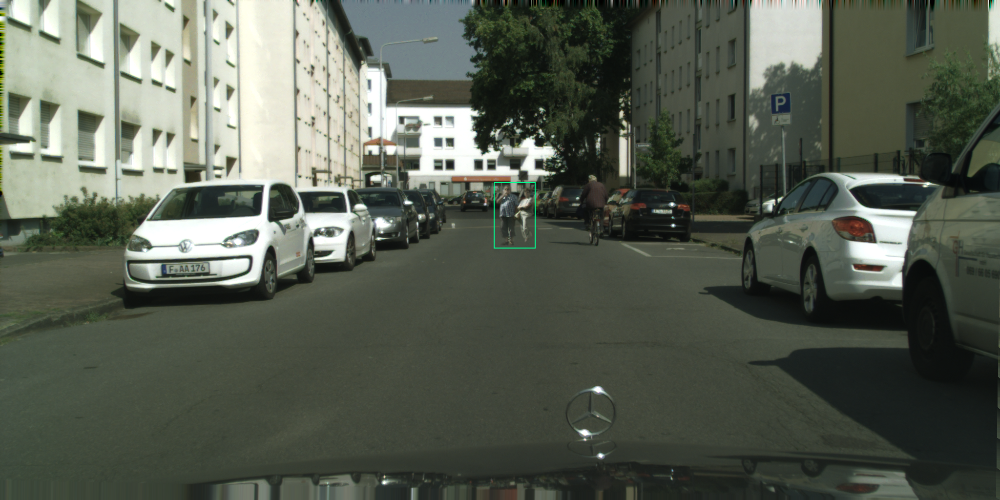

    - Height of the instance augmented in is 40-50% of the image height.

    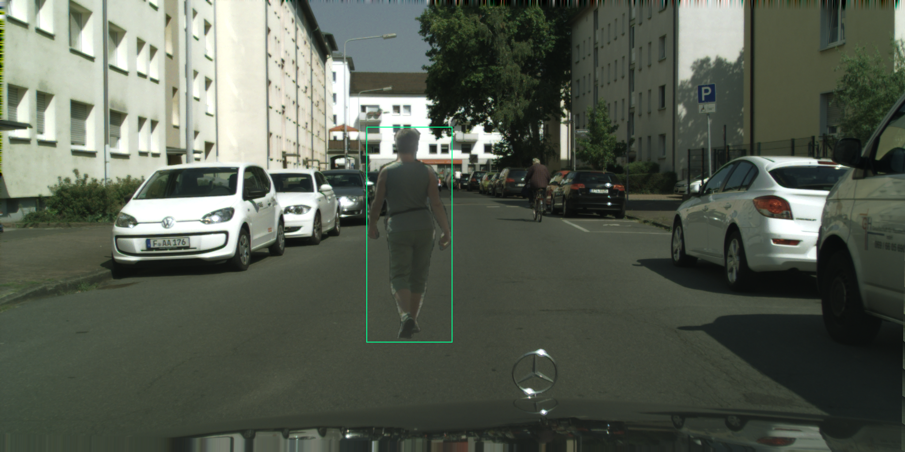


## Proper Scaling and Proper Placement
Instances are copied and pasted into suitable user-defined areas. They are also scaled appropriately using a horizon line which is also defined by the user. For example :
 - People are scaled according to a scaling triangle created with the help of a `horizon line` defined by the user.

 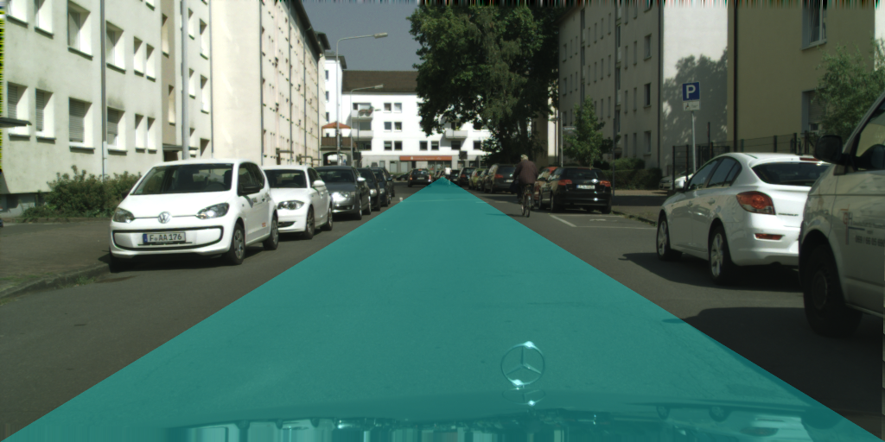

 - People are augmented on walkable classes such as `road`, `sidewalk`, `parking`, `ground`.

 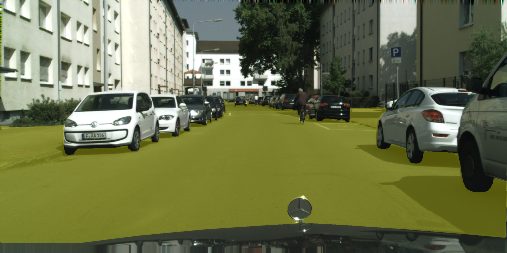

 - Augmentation heights are not limited in the previous image. If we limit to 10-20% and 40-50%, the possible locations are as follows :

 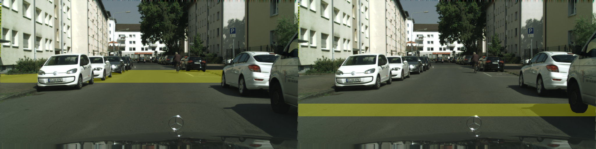

 - Using this, we can augment multiple instances into an image.

 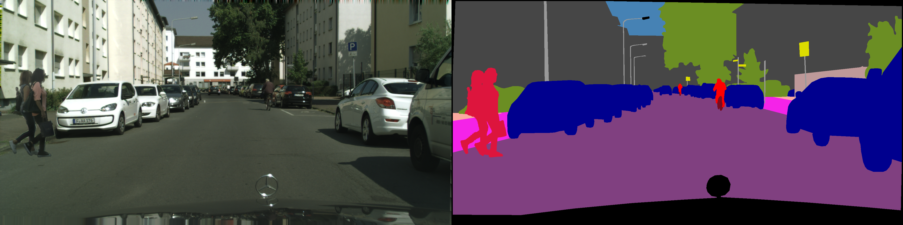
 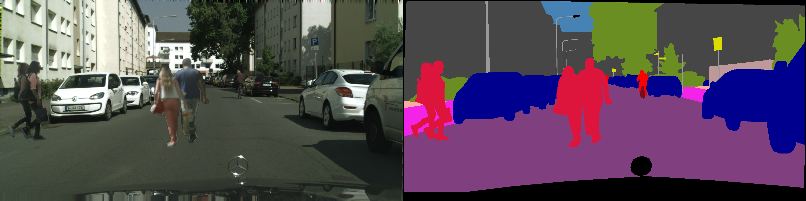

Results for **1 person** augmented per image with proper scaling and proper placement. **This can be done on *any* class present in the dataset**.

Limit % | IoU (1 ep) | Best IoU (50 ep)
------- | ---------- | ---------
Baseline | 0 | 48.73
0-10  | 0    | 50.71
10-20 | 0    | 51.83
20-30 | 0    | 53.48
30-40 | 4.5  | 52.35
40-50 | 24.8 | 52.28
50-60 | 34.3 | 52.23

Results for **2 people** augmented per image with proper scaling and proper placement.

Limit % | IoU (1 ep) | Best IoU (50 ep)
------- | ---------- | ---------
Baseline | 0 | 48.73
0-10  | 0    | 49.7
10-20 | 0    | 52.97
20-30 | 1.4  | 54
30-40 | 10.9 | 52.06
40-50 | 40.1 | 53.43
50-60 | 40   | 50.96


## Proper Scaling and Random Placement
Instances can be augmented anywhere in the image (points below the horizon line). If the horizon line isn't defined, scaling loses all meaning, hence we need to define it for this type of augmentation. Instances will be placed on incorrect surfaces but will be scaled accurately. The scale limiting function works here as well.
- Augmentation using proper scaling and random placement

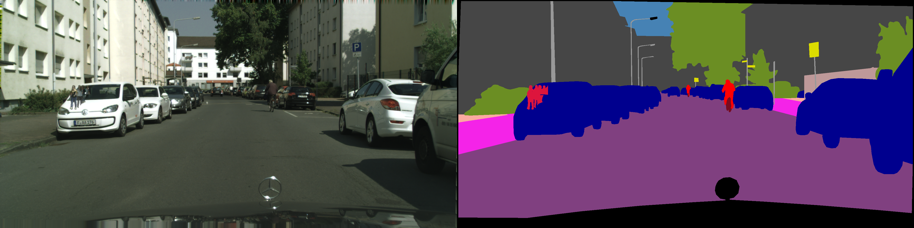

- Possible placements when there are no placement areas defined(everypoint under the horizon line).


- If scale limiting is set to 10-20%.

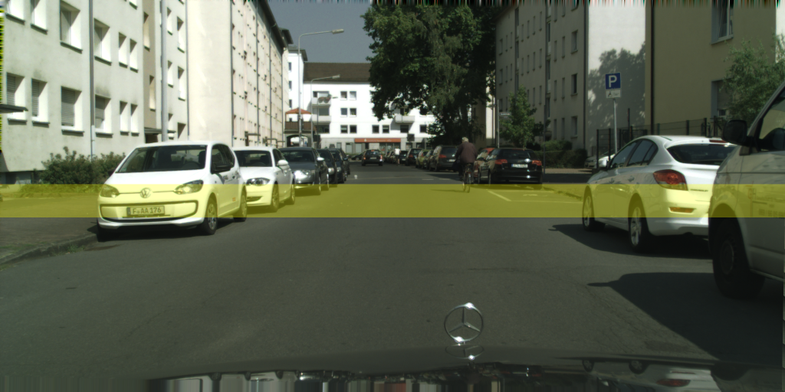

## Random Scaling and Proper Placement
Instances can be augmented in user-defined areas but will be scaled randomly. Limiting function is WIP.

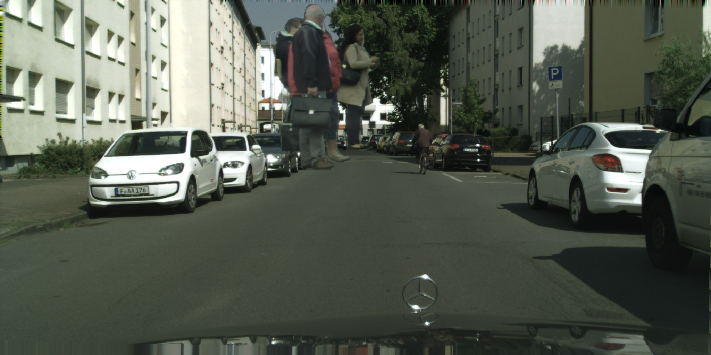

## Random Scaling and Random Placement
Instances can be augmented anywhere in the image and will be scaled randomly.

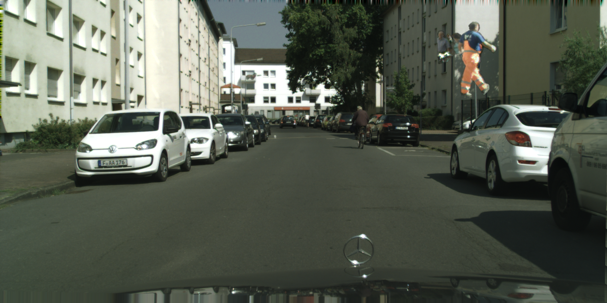

Results for **1 person** augmented per image with random scaling and random placement.

Limit % | IoU (1 ep) | Best IoU (50 ep)
------- | ---------- | ---------
Baseline | 0 | 48.73
0-10  | 0    | 49.41
10-20 | 0    | 50
20-30 | 0    | 51.59
30-40 | 17.1 | 52.5
40-50 | 18.1 | 52.37
50-60 | 36.2 | 51.3


## Requirements

- OpenCV
- NumPy

## Usage

- Refer to `sample_1.py` for details.
- Modify `labels.py` to add classes and their BGR values according to your dataset.
- Modify and run `class_extractor.py` :
    - Add the image and label paths.
    - Change `object_name` to the object you want to augment (should match a name in `labels.py`).
    - You can modify `min_h` and `min_w` values which determine the minimum height and width for an instance to be considered usable.
- Getting started :
    ```python
    from labels import *
    from Augmenter import base_augmenter as ba
    ```
- Define `class_id` which contains the BGR value of the class.
- Define `placement_id` which contains the suitable surfaces that can be augmented on.
- Define `horizon_line` which controls the scaling.
- Define `max_height` which determines how big an instance can get (right infront of the camera).
  ```python
  class_id = names2labels["person"].color
  placement_id = (names2labels["sidewalk"].color)

  horizon_line = int(rows * 0.4)
  max_height = int(rows * 0.8)
  ```
- Go through your dataset and augment images using 1 of the 4 ways.
    ```python
    aug = ba.BaseAugmenter(image, label, class_id, placement_id=placement_id, horizon_line=horizon_line, max_height=max_height)
    ```
    - Pass both `placement_id` and `horizon_line` for **Proper Scaling and Proper Placement**.
    - Pass `horizon_line` for **Proper Scaling and Random Placement**.
    - Pass `placement_id` for **Random Scaling and Proper Placement**.
    - Don't pass either for **Random Scaling and Random Placement**.
- After this, use `place_class(num_instances_per_image, path_to_instances)` which returns an augmented image and the corresponding label.
    ```python
    img, lbl = aug.place_class(1, aug_class_path)
    ```
- For scale limiting of 40-50% :
  ```python
  aug.set_limit((0.4, 0.5))
  ```
- You can use `utils.viz_placement(aug)` and `utils.viz_scaling_triangle(aug)` to visualize the placements and scaling triangle.
